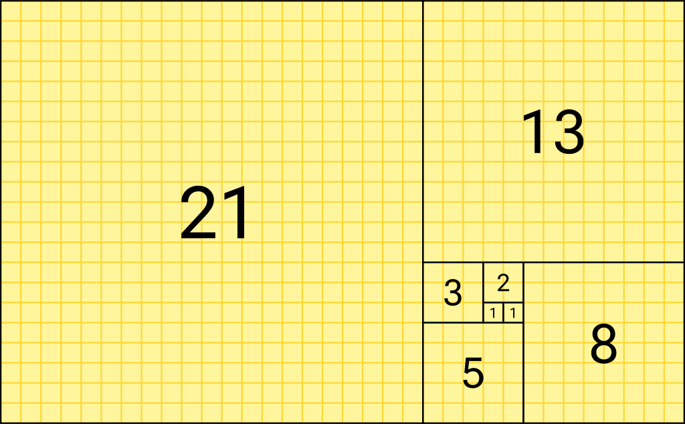

# Fibonacci solver

## overview:
The Fibonacci sequence is a sequence in which each number is the sum of the two preceding ones. Numbers that are part of the Fibonacci sequence are known as Fibonacci numbers, commonly denoted Fn

## Features: 
- you can input an index and the return will be the fibinachi number at that index
- starts as 0:0 1:2 2:3 3:5 and so on
- writen in rust 🚀

## Goals:
- returning the index of an inputeted fib number
- maybe more ??
